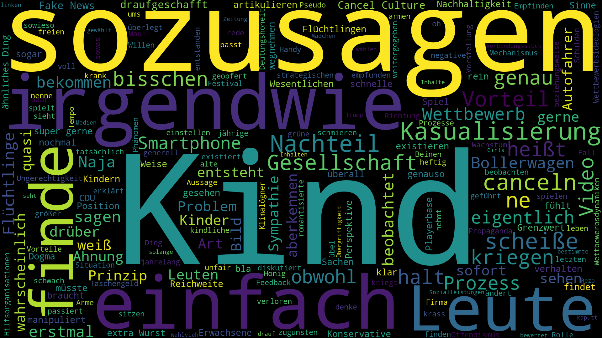

# 📊 Wortanalyse & Wordcloud-Generator

Dieses Miniprojekt besteht aus zwei Python-Skripten zur Analyse von Texten:

1. **Häufigkeitsanalyse**: Zählt die Vorkommen aller Wörter in einer Textdatei – unter Ausschluss definierter *Stopwörter*.
2. **Wordcloud-Erstellung**: Generiert eine Wordcloud aus demselben Text.

## 📁 Projektstruktur

```
.
├── beitrag.txt          # Eingabetext (Analysegrundlage)
├── stopwords.txt        # Liste an zu ignorierenden Wörtern (Stopwörter)
├── wortanalyse.py       # Skript zur Häufigkeitsausgabe
├── wordcloud_gen.py     # Skript zur Wordcloud-Erzeugung
```

## 🧠 Funktionen

### wortanalyse.py

Liest einen Text aus `beitrag.txt`, entfernt gängige Wörter aus `stopwords.txt`, zählt alle übrigen Wörter und gibt sie sortiert nach Häufigkeit aus.

**Beispielausgabe:**
```
daten: 12  
analyse: 9  
python: 8  
```

### wordcloud_gen.py

Verwendet die Bibliothek [`wordcloud`](https://github.com/amueller/word_cloud), um eine visuelle Darstellung der Wortverteilung zu erzeugen.

> Hinweis: Die Funktion `wordcloud.to_file('wordcloud.png')` ist aktuell auskommentiert, kann aber leicht aktiviert werden, um ein Bild zu speichern.

## ✅ Voraussetzungen

- Python 3.x
- Abhängigkeiten:
  ```bash
  pip install wordcloud matplotlib
  ```

## ▶️ Verwendung

1. **Texte bereitstellen**:
   - Speichere deinen Analyse-Text in `beitrag.txt`
   - Liste der auszuschließenden Wörter in `stopwords.txt` (ein Wort pro Zeile)

2. **Wortanzahl analysieren**:
   ```bash
   python wortanalyse.py
   ```

3. **Wordcloud erzeugen**:
   ```bash
   python wordcloud_gen.py
   ```

## 📌 Hinweise

- Die Stopwörterliste ist flexibel und lässt sich leicht anpassen.
- Zeichensetzung wird entfernt, um konsistente Wortformen zu erhalten.
- Die Ausgabe erfolgt in der Konsole bzw. kann visuell als PNG gespeichert werden.

## 📷 Beispiel

